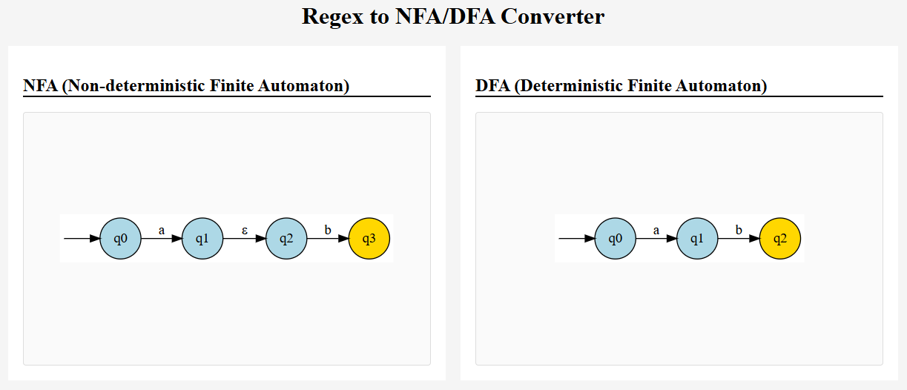
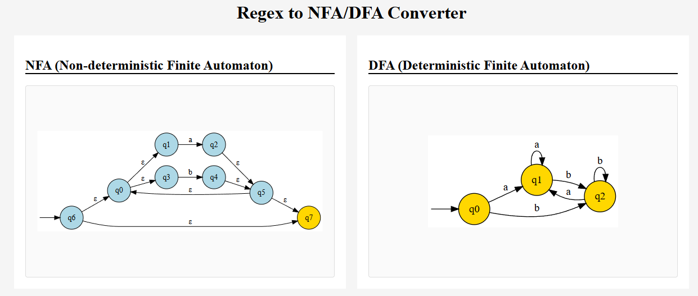
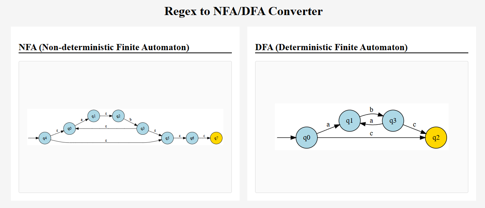

# State Machine Visualizer

## Features

- Converts regular expressions to postfix notation
- Implements Thompson's construction to build NFAs from regular expressions
- Converts NFAs to optimized DFAs using subset construction
- Supports Kleene star (*), concatenation (.), and alternation (|) operations

## Building it on WSL

1. mkdir build && cd build
2. cmake ..
3. make

## Executing the Program

The program is executed as follows:
```
<path to your build folder>$ ./state_machine_visualizer ../inputs/<filename>.txt
```

The input files from the `inputs/` folder are then read and outputted to `index.html`.

## Example Outputs

Here are the outputs you can generate:

### Input 1: `a.b`


### Input 2: `(a|b)*`


### Input 3: `(a.b)*.c`
